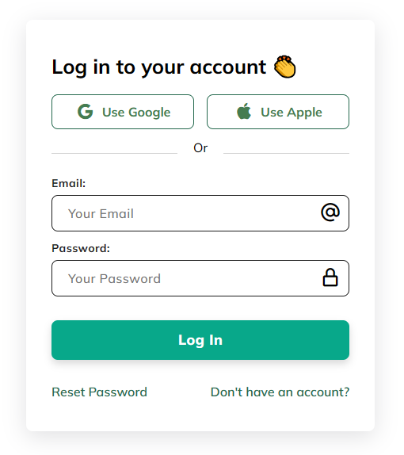

# Minimal Log In Design

I'm going to show you how to use modern HTML, CSS, and JavaScript to create a completely responsive log in page. We'll be use CSS Flexbox and Media queries for our responsive design, and CSS transitions for some cool animation effects. This Log in design is responsive in all devices!

Find the tutorial video here:
 
 
**[ASMR Programming - Responsive Login Form - No Talking](https://youtu.be/LHu5YO-0Qo0)**
 
_24 Dec 2023_
 
 

Video's by: <a href="https://youtube.com/@AsmrProg" target="_blank">AsmrProg</a> Youtube Channel

## Screenshot

Here we have project screenshot:

